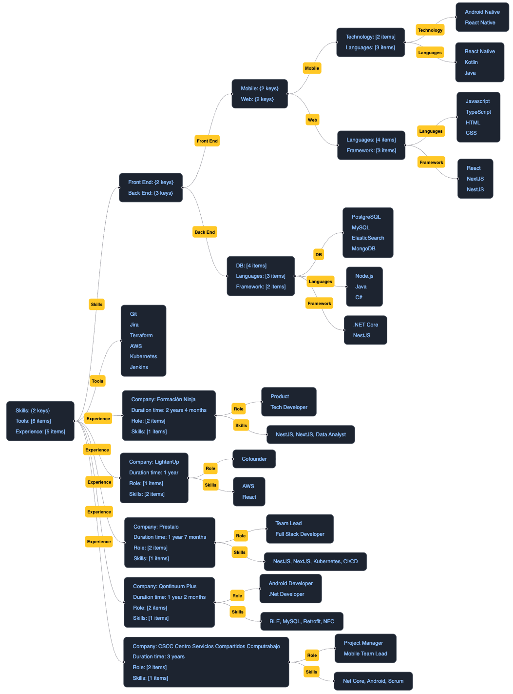

# JSON to Diagram with React Flow

A React-based application that transforms a **JSON object** into an **interactive diagram** using [React Flow](https://reactflow.dev/).  
Ideal for visualizing hierarchical data, workflows, mind maps, or any structured information in a clear and dynamic way.

## 🚀 Features

- 📄 **JSON Input** → Visualizes any valid JSON structure as a diagram.
- 🖱 **NON Interactive** → Drag and rearrange nodes freely are blocked. Diagram is reordered automatically.
- 🎨 **Custom Styling** → Easily change node colors, shapes, and styles.
- ↕️ **Horizontal / Vertical viewer** → You can change the format between horizontal and vertical
- 📦 Built with **React** and **React Flow** for flexibility and performance.

## 📂 Project Structure

```
├── app
│ ├── page.tsx # Main application
├── src
│ ├── components # UI components
│ ├── lib # Library & Utils folder
├── public
│ ├── sample-cv.json # An example of JSON
└── package.json
```

## 🛠 Tech Stack

- **React** – Frontend library
- **React Flow** – Graph rendering and interactions
- **JavaScript / ES6+**
- **CSS Modules** - Tailwind

## 📥 Installation

```bash
# Clone the repository
git clone https://github.com/trujis/json-viewer.git

# Navigate into the project folder
cd json-viewer

# Install dependencies
pnpm install
```

▶️ Usage

```bash
# Start the development server
pnpm dev
```

```bash
# Build a production server
pnpm build
pnpm start
```

Open your browser at http://localhost:3000 and paste your JSON to see it transformed into an interactive diagram.

## 📌 Example of Generated Diagram:



## 🧩 How It Works

1. The JSON is parsed into a tree-like data structure.

2. Nodes and edges are generated based on keys and values.

3. React Flow renders the diagram with customizable layouts and styles.

## 🤝 Contributing

Contributions are welcome!
Feel free to open issues or submit pull requests for improvements, bug fixes, or new features.

## 📄 License

This project is licensed under the MIT License.

Author: Guillem Trujillo Ruiz
[LinkedIn](https://www.linkedin.com/in/truji/)
